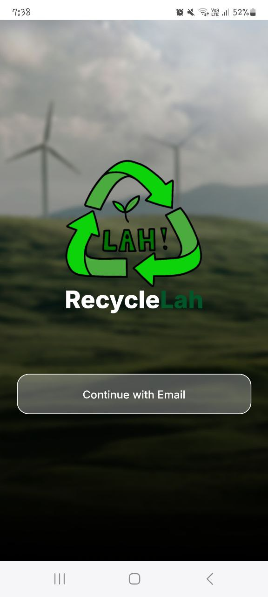
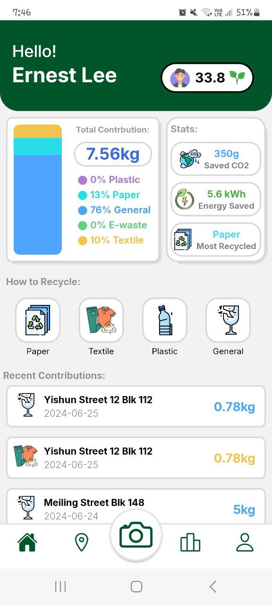
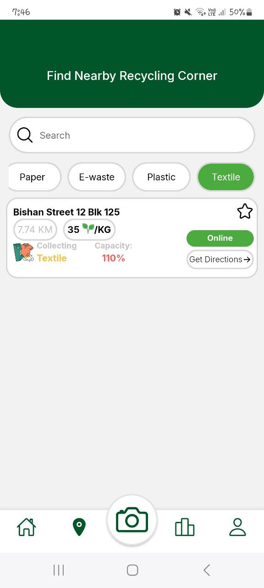
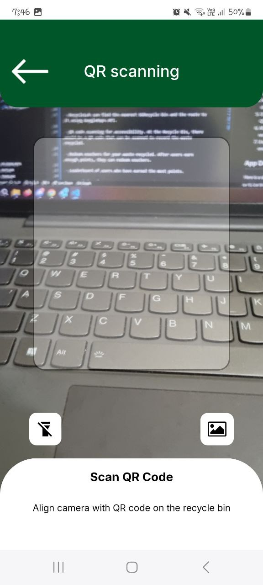
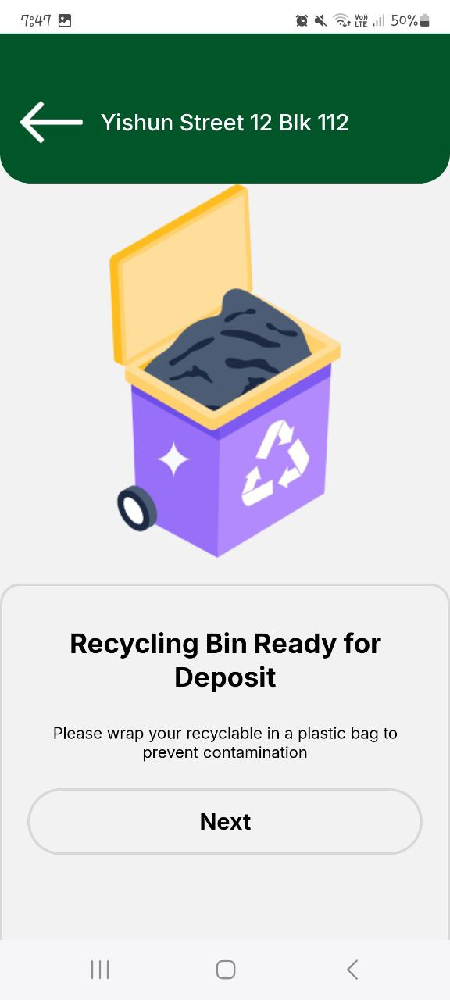
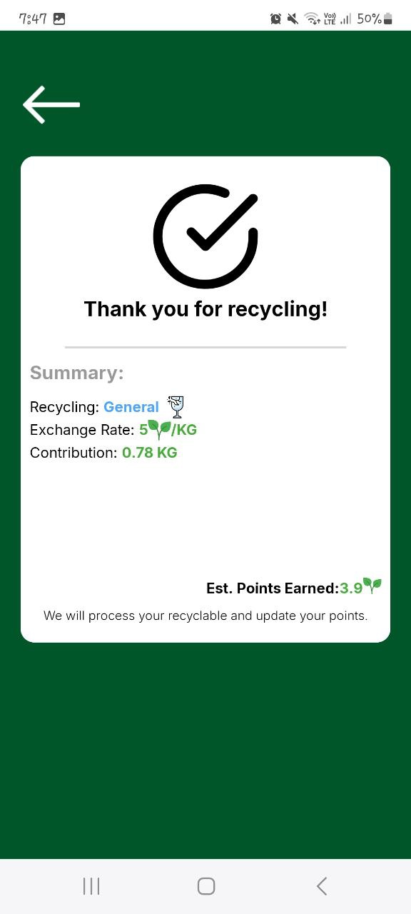
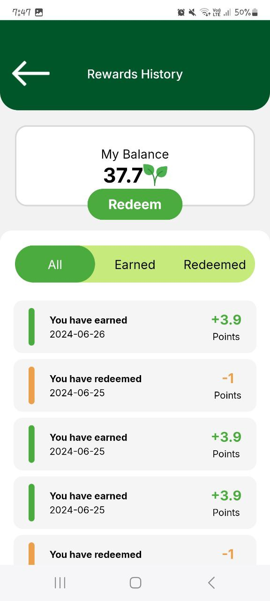
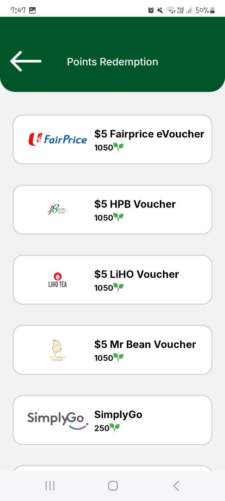

<h1 style="text-align: center">RecycleLah</h1>

<p style="text-align: center">Introducing RecycleLah - An eco-friendly waste management app.</p>
<div style="text-align: center">
</div>

## What is RecycleLah?

RecycleLah is an eco-friendly waste management app that helps you keep track of your waste. You can earn points for each type of waste you collect. You can also earn badges for your waste collection. Afterwards, you can convert these points to discounts to various purchases including LiHO, FairPrice, and many more!

## Motivation

Climate change is a global issue. We need to reduce waste. "There was a decline in the overall recycling rate over the past decade, especially for paper and cardboard. Paper recycling dropped from over 50 per cent a decade ago to 31 per cent in 2023." - [NEA 2022](https://www.nea.gov.sg/our-services/waste-management/waste-statistics-and-overall-recycling#:~:text=The%20overall%20recycling%20rate%20decreased,recycled%2C%20dropping%20significantly%20last%20year.)

Hence, to promote recyling of waste, I created RecycleLah.

## Features

- RecycleLah can find the nearest SGRecycle bin and the route to it using GoogleMaps API.

- QR code scanning for accessibility. At the Recycle Bin, there would be a QR code that can be scanned to record the waste recycled.

  - Information contained in the QR code: bin location, type of bin, points/kg rate and current capacity

- Redeem vouchers for your waste recycled. After users earn enough points, they can redeem vouchers.

- Leaderboard of users who have earned the most points.

## User lifecycle

1. User wants to recycle their used clothes.

   
   

2. User can log in to their RecycleLah app and go to the 'Location' tab to display all the SGRecycle Bins near him.
3. User can filter for the "Textile" category or type in the location of his desired bin.
4. After choosing a bin, user can press on "Get directions" and GoogleMaps will show the route to the bin.

   
   

5. Once user is at the SGRecycle Bin, user can go to the "Camera" tab to scan the QR code on the bin and begin recycling.
6. After recycling, points will be calculated based on the weight of the items recycled. Points will be updated shortly.
7. User can use the points to redeem a "LiHO voucher if he has accumulated enough points.

   
   
   

## App Demo

Here is a simple app demo to demonstrate the features.

[](https://www.youtube.com/watch?v=j7KPU-kUp40)

## Challenges faced

- Unfamiliar with using Supabase
  - Spent 2 - 3 days trying to get it to work

## Key Learning Points from this project

- Learnt how to use Supabase, an open-source backend-as-a-service platform.

  - Implemented the Login/Signup functionalities.
  - Record User information and their recycling history.

- Learnt to use GoogleMaps API to show the route to the SGRecycle

- Linking up all the data between pages and updating User data.

- Familarise to using React Native for app development

## Todos:

- Finish the settings page
- The calculations of CO2 and Energy is unclear.
- Setting up the Badge achievements.
- Purpose of level is not clear for now.
  - There needs to be a way to level up and rewards.

## Limitations of RecycleLah

- Putting QR code on all the bins require a lot of manual work.
- Having a weighing scale in all the bins to determine weight of recycled items is not feasible.
  - Possible solution: Develop an AI model that can predict the dimensions of the items to calculate the points instead of using weight.

## Get started

1. Clone the repository

2. Install dependencies

   ```bash
   npm install
   ```

3. Start the app

   ```bash
    npx expo start
   ```
  
  4. Install the Expo Go app and scan the qr code to begin
